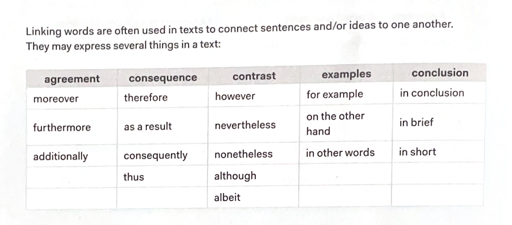
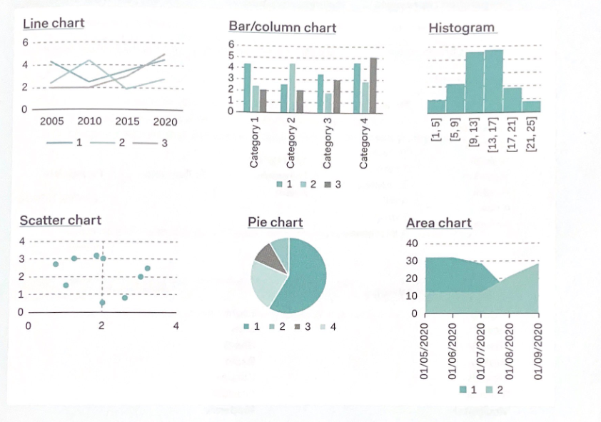
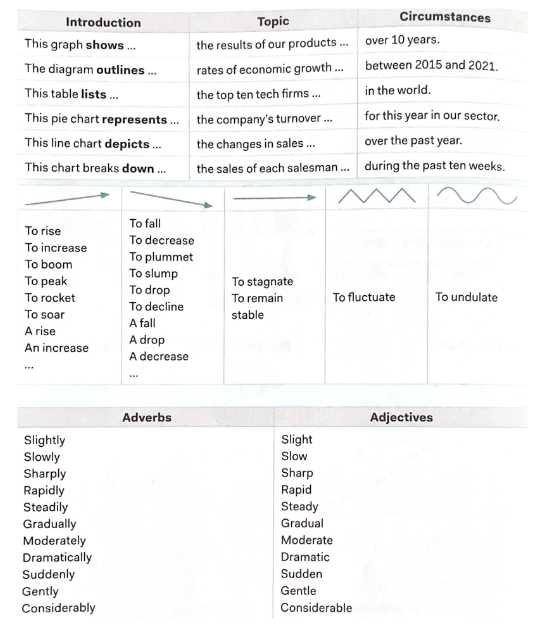
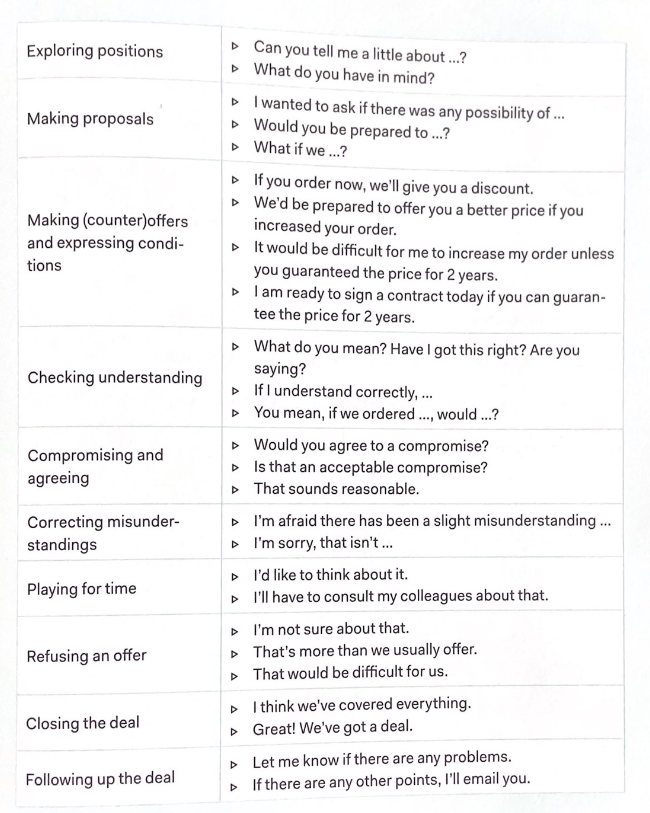

  <h1>Communication Lab Samenvatting</h1>
  
Zülfikar Kaya

## Unit 1
#### Polite mails
- **Formal greeting**
  - Dear sir or madam
  - Dear Mr. Smith
  - Dear Tom
- **Informal greeting**
  - Hey 

###### Complementary close
-  **Formal close**
   - Kind regards
   - Best wishes
- **Informal close**
    - See ya man
    - Cheers

###### How Polite
- **Add please to sentences**
  - Could you please let me know when the next information session will take place?
- **Use could or would like**
  - I would like to inquire about the price of tickets .
- **Avoid imperatives, even when adding please *// Geen bevel aub***
  - (Please) Send me more information on this product.

- **Requesting information**
  - I would be grateful if you could...
  - Assistance requests
    - Would you be able to help...?
  - Information requests
    - Would you be able to send me ...?
    - Could you please send me...?
  
- **Replies**
  - Thank you for your inquiry/email.
  - Thank you for your interest.

**Giving Good News**
- I am delighted to inform you that ...
- Unfortunately, I am unable to answer all of your questions.

**Giving Bad News**
- I regret to tell you that ...
- My apologies for the inconvenience.
- This is due to/thanks to ...
- This is a result of factors beyond our control/this was due to circumstances beyond our control.

**Attachments**
- Attached please find ...
- Please find attached ...
- As requested I attach a copy of our ...
- I am sending you the materials that you asked for.
- I’m pleased to send you ..

###### Telephoning skipped
## Unit 2
### Writing business mails
#### Linking words

#### Comparisons
- Use comparative to compare things to one another
  - fast -> faster
  - expensive -> more expensive

- Contrast and agreement
  -   like - similar to - also - similarly - in the same way - again - still - at the same time
- Similarities
  - While - on the one hand ... on the other hand
  - unlike - compared to - in contrast - contrasted with - on the contrary - yet - but - despite

#### Useful Vocabulary
- Agenda - document sent to all participants in the meeting
- Chair(man) - person who presides over the meeting
- Adopt minutes - minutes are accepted by members and signed by chairman
- AGM - Annual General Meeting
- Attendance list - overview of who is present
- Apologies - excuses given in advance as to why you cannot attend the meeting
- Absent with/without notice - someone who did/did not notify the Chair that he/she was not going to attend the meeting
- Present - the persons present
- To take minutes - to take notes
- To adjourn - to temporarily end a meeting
- AOB - any other business - either leftover items from another meeting, or items to be discussed after the main business of a meeting

#### Chairing a Meeting
- **Starting the Meeting**
  - Good afternoon, everybody.
  - Does everyone have a copy of the agenda?
- **Explaining the Purpose of the Meeting**
  - Today we are going to discuss the following issues ...
- **Prioritizing and Starting**
  - The most urgent matter is ...
  - We're going to start with ...
  - The first/main point we need to discuss ...
- **Asking for Opinions**
  - What do you think about this?
  - Do you agree?
  - Has anyone got anything to add?
- **Moving the Meeting On**
  - Let's move on to the next point on the agenda.
  - Moving on to the next matter ...
- **Closing the Meeting**
  - To summarize ...
  - Summarizing, ...
  - In short,
  - That's all for today.
  - Let's meet again on 5/10 to follow up on/confirm/check progress/..

###### De rest was in debates (Oral exam)
## Unit 3
###### debates (Oral exam)

## Unit 4

**Before Meeting Business Partners**
- It might be interesting to find out:
  - Something about their country
  - Political situation
  - Cultural differences
  - The role of women in business
  - The economy
  - Competitors
  - The market
- You might also want to find out:
  - Which topics are good for small talk/which topics should be avoided
- If you are going to visit another country:
  - Attitudes towards foreigners and their conventions (e.g., food/drink/clothes)

**Opinion piece**

- Every opinion piece must have a clearly defined topix and theme.
  -  ask yourself what the primary focus of your opinion piece is.
  - topic is usually mentioned in the first paragraph
  - What is the point that you are trying to make? why is it important?

**Final Checklist**
- Check clarity - is it to the point, is your opinion clearly expressed?
- Check coherence and unity - use of linking words, one topic per paragraph,
- Check voice and tone - who is your audience?
- Check the consistency of your opinion - does it make sense? Are there any contradictions?
- Check your sources, if you have used any

**Modal Verbs**
- Possibilities: can, could, be able to, may, might
- Certainty: must, should, shall abilities: can, could, be able to
- Permission: can, could, may requests: could, would, will
- Obligations: must, had to suggestions: should, could

**Use of conditionals**

You may want to use conditionals in an opinion piece to express that something might be a future (unlikely) possibility, or to discuss a hypothetical situation in the past.

| Conditional | Conditional clause | Main clause |
|-------------|---------------------|-------------|
| **Zero conditional (cause-effect)** | **present simple** | **present simple** |
|                                        | If water reaches 100 degrees, | it boils. |
| **First conditional (likely possibility)** | **present simple** | **will + infinitive** |
|                                        | If I study for the exam, | I will pass. |
| **Second conditional (unlikely possibility)** | **past simple** |**would + infinitive**|
|                                        | If I won the lottery, | I would buy a Ferrari. |
| **Third conditional (hypothetical situation in the past)** | **past perfect** | **would have + past participle** |
|                                        | If I had drunk less last night, | I would have gone to class today. |
## Unit 5
### Describing trends
#### Types of graphs

#### Vocabulary

#### Prepositions

- ► An increase in something by ...%
- ► A decrease in something from ...% to ...%
- ► The number of people using the Internet peaked at ...%
- ► The number of people using the Internet decreased to ...%

#### Tenses

You use a past simple (1) to describe facts in the past, a present perfect (2) to describe facts that have a connection between the past and present, and the present simple (3) to describe general facts.

1. In 2015, the number of Internet connections increased to 25,000.
2. Since 2015, the number of Internet connections has risen.
3. The graph shows that the number of Internet connections is high nowadays.

#### False Friends

1. Graph: a picture that shows how two sets of variables are related, usually by lines or curves

   Graphic: a drawing or picture (that shows information)

2. The graph knew an increase in ... ► The graph had an increase in ...

## Unit 6

### Negotiations

#### Stages in negotiations

**Stage 1: Preparing**
- Prepare your strategy
  - What are your objectives?
  - What do you know about the other party?
  - What concessions can you make?

**Stage 2: Exploring**
- Building a rapport with the other party
  - What is important to them?
  - What can they be aligned with your interests?

**Stage 3: Bargaining**
- The main part of the negotiation
  - State your opening position
  - Make your suggestions
  - Try to find common ground
    - What is important to the other party?
    - What is important to you?
    - If you cannot agree, what is the second best option?

**Stage 4: Concluding**
- Ensure that the negotiation has a clear and satisfactory end
  - Try to reach an agreement

#### Main principles of negotiations

- Focus on the issue at hand, not the personality of the other party.
- Do not attack the other party personally.
- Try to understand why the other party has to say, show that you are listening, and take notes.
- Make sure the other party understands what you are saying by rephrasing what you have said into a common shorthand.
- Take the other party's needs into consideration. Acknowledge what the other party has just said.
- Establish trust from the beginning.
- Develop a common goal.
#### Language for negotiation

###### Writing a memo (skipped)