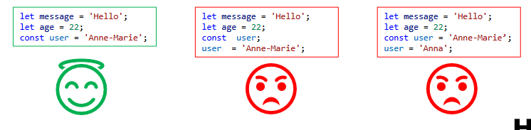
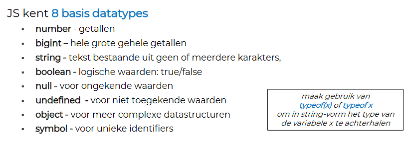
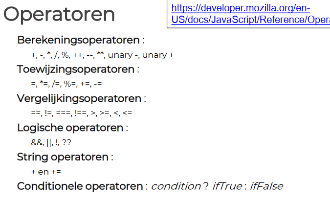
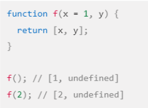
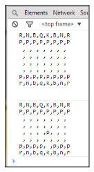

<div style="display: flex; justify-content: space-between; align-items: baseline;">
  <h1>WebDev Samenvatting</h1>
  <p style="color: grey; font-size: smaller;">Zülfikar Kaya</p>
</div>

<div class="title">
  <p>Test <span style="color: #a41d34;">Web</span><span style="color: #14c0f1;">Dev</span></p>
</div>

## Hoofdstuk 1
### Statements

- `console.log();` - Toont uitvoer in de console.
- `alert();` - Toont uitvoer in een simpel dialoogvenster.

```javascript
/*
this is a comment 
*/

// begin van JS!! = 
"use strict";

// variabelen declareren = 

let message;

const = variabelen die je moet initialiseren bij declaratie en die nadien niet meer van waarde kunnen veranderen
``` 




### Datatypes

#### Number

##### Speciale waarden

- **NaN:** Is alles behalve een number.
  - `isNaN()` is een boolse functie die detecteert of een waarde NaN is.

- **Infinity:** Een berekening die een getal retourneert buiten het waardenbereik, retourneert Infinity of –Infinity.
  - `isFinite()` is een boolse functie die detecteert of een waarde finite is.

- **parseInt():** Converteert string naar geheel getal. Leading spaces in de string worden genegeerd.


#### Undefined

- Staat voor een onbekende waarde.
- Een variabele waaraan nog geen waarde is toegekend bevat de waarde undefined.

#### BigInt

- Gebruik de suffix `n` voor bigint literals.


## Wrapper Objects: Number

- `toString(x)`: String representatie, x is de radix, default 10. Voorbeelden van properties.
- `toFixed(x)`: Afronden tot x cijfers na de komma.
- `Number.MAX_VALUE`: Grootste getal (-1.7976931348623157e+308).
- `Number.NaN`: Idem als NaN, maar Property van Number.
- `Number.MIN_VALUE`: Constante voor kleinste getal (5e-324).



## Hoofdstuk 2

### Functions
<strong>Default parameters</strong>
<div style="display: flex; align-items: center;">
  
  <p><strong>Note:</strong> Merk op dat parameters positioneel worden ingesteld: left-to-right.</p>
</div>


### GlobalThis

- JavaScript’s `globalThis`: Deze property bevat de globale this waarde, het verwijst naar het globale object.

## Arrays

Declaration of an empty array can be done in two ways:

```javascript
const pizzas = [];
const pizzas = new Array();

// voorbeeld van een aray met met elementen van verschillende types
const mixedArray = [null, 1, 'two', true, undefined ];
```

### Raadplegen van een Element adhv de Index

- Index start vanaf 0, gebruik `[ ]` - notatie.
- `length`: Aantal elementen in array.
- De volledige array weergeven:

```javascript
const pizzas = ['Margherita', 'Mushroom', 'Spinach & Rocket', 'Pineapple & Sweetcorn'];
console.log(pizzas[2]); //Spinach & Rocket
console.log(`eerste pizza ${pizzas[0]}`); //Margherita
console.log(`laatste pizza ${pizzas[pizzas.length-1]}`); //Pineapple & Sweetcorn

//volledig array weergeven
console.log(pizzas); // Array(4) ['Margherita', 'Mushroom', 'Spinach & Rocket', 'Pineapple & Sweetcorn'];
```

### Iterating Over an Array

You can iterate over an array using a ```for``` loop or a ```for...of``` loop:

```javascript
// Using a for loop
for (let i = 0; i < pizzas.length; i++) {
    console.log(pizzas[i]);
}

// Using a for...of loop
for (let value of pizzas) {
    console.log(value);
}
```
## Array Methods

### Pop

- `pop()`: Verwijdert het laatste element uit array en retourneert dit element.

```javascript
const pizzas = ['Margherita', 'Mushroom', 'Spinach & Rocket'];
pizzas.pop(); // 'Spinach & Rocket'
console.log(pizzas); // ['Margherita', 'Mushroom']
```

### Push

- `push()`: Voegt één of meerdere waarden toe aan het einde van de array en retourneert de nieuwe lengte van de array.

```javascript
pizzas.push('Pepperoni'); // 3
```
### Shift

- `shift()`: Verwijdert de eerste waarde in array en returnt deze waarde.

```javascript
pizzas.shift(); // 'Margherita'
```

### Unshift

- `unshift()`: Voegt één of meerdere waarden toe aan het begin van het array en returnt de nieuwe lengte van de array.

```javascript	
pizzas.unshift('Chicken & Bacon'); // 3
```

### Concat

- `concat()`: Voegt 2 arrays samen.

### Reverse

- `reverse()`: Keert de volgorde van de array elementen om.

### Slice

- `slice(start_index, upto_index)`: Returnt een nieuw array als een stuk van de oorspronkelijke array met als argumenten de begin- en een eindpositie.

### Splice

- `splice(start_index, numberofitemsToRemove, waarde1,…, waardex)`: Verwijdert numberofItemsToRemove waarden uit de array startend op positie start_index en voegt dan de nieuwe waarden toe waarde1,… waardex.

### Sort

- `sort()`: Sorteert de elementen in de array.

### IndexOf

- `indexOf(searchElement[, fromIndex])`: De index van het eerste voorkomen van het element vanaf fromIndex.

### LastIndexOf

- `lastIndexOf(searchElement[, fromIndex])`: Idem indexOf maar begint achteraan.

### Join

- `join()`: Converteert alle elementen van een array tot 1 lange string.

### Destructuring Assignment

- `destructuring assignment`: Is een manier om meerdere waarden te extraheren uit een array en toe te kennen aan variabelen.

```javascript
// Variabele declaraties
// ophalen van eerste en tweede item uit een array
const pizzas = ['Margherita', 'Mushroom', 'Spinach & Rocket', 'Chicken & Bacon'];
const [eerstePizza, tweedePizza] = pizzas;
console.log(eerstePizza); // Margherita
console.log(tweedePizza); // Mushroom

// ophalen van derde item uit een array
const [, , derdePizza] = pizzas;
console.log(derdePizza); //Spinach & Rocket

// Destructuring Assignment
const pizzas = ['Margherita', 'Mushroom', 'Spinach & Rocket'];
let pizza1, pizza2;
[pizza1, pizza2] = pizzas;
console.log(pizza1); // Margherita
console.log(pizza2); // Mushroom

// default values
pizzas = ['Margherita'];
[pizza1, pizza2 = 'Mushrooms' ] = pizzas;
console.log(pizza1); // Margherita
console.log(pizza2); // Mushrooms

// Swapping variables in ECMAScript 5
let a = 1,b = 2, tmp;
tmp = a;
a = b;
b = tmp;
console.log(a); // 2
console.log(b); // 1

// Swapping variables vanaf ECMAScript 6
a = 1;
b = 2;
[ a, b ] = [ b, a ];
console.log(a); // 2
console.log(b); // 1
``` 

  <h3>Voorbeeld Dimensionale Array</h3>
<div style="display: flex; align-items: center;">
<div style="display: flex-box; align-items: left; max-width: 200px;">
  <p>Een schaakbord, voorgesteld als een 2 dimensionele array van strings. De eerste zet verplaatst ‘p’ van positie (6,4) naar (4,4). 6,4 wordt op blanco geplaatst.</p>
</div>

  <pre><code>
  function playChess() {
    const board = [
      ['R', 'N', 'B', 'Q', 'K', 'B', 'N', 'R'],
      ['P', 'P', 'P', 'P', 'P', 'P', 'P', 'P'],
      [' ', ' ', ' ', ' ', ' ', ' ', ' ', ' '],
      [' ', ' ', ' ', ' ', ' ', ' ', ' ', ' '],
      [' ', ' ', ' ', ' ', ' ', ' ', ' ', ' '],
      [' ', ' ', ' ', ' ', ' ', ' ', ' ', ' '],
      ['p', 'p', 'p', 'p', 'p', 'p', 'p', 'p'],
      ['r', 'n', 'b', 'q', 'k', 'b', 'n', 'r']
    ];
    console.log(board.join('\n') + '\n\n');
    board[4][4] = board[6][4]; // Move King's Pawn forward 2
    board[6][4] = ' ';
    console.log(board.join('\n'));
  }
  </code></pre> 

  
</div>

### Export en Import Modules in JavaScript

In JavaScript kunt u code uit één bestand exporteren en importeren in een ander bestand met behulp van de export en import statements. Dit helpt om de code te organiseren en herbruikbaar te maken.

```javascript
// exporteren van een module
export const name = 'value';

// importeren van een module
import { name } from './module.js';
```
Met de export statement kunt u variabelen, functies, objecten, enz. exporteren vanuit een JavaScript-bestand. Met de import statement kunt u deze geëxporteerde code importeren in een ander JavaScript-bestand.

Stel dat je een functie hebt die je wilt exporteren vanuit een bestand genaamd `myModule.js`:

```javascript
// myModule.js
export function myFunction() {
  return 'Hello, world!';
}
```


In dit voorbeeld wordt de functie myFunction geëxporteerd uit myModule.js.

Voorbeeld van Import in JavaScript
Nu wil je de geëxporteerde functie myFunction gebruiken in een ander bestand. Je kunt dit doen door de functie te importeren:\
```javascript
// app.js
import { myFunction } from './myModule.js';

console.log(myFunction()); // Outputs: 'Hello, world!'
```
In dit voorbeeld wordt de geëxporteerde functie myFunction geïmporteerd in app.js en vervolgens gebruikt. 

## Hoofdstuk 3
### Objecten en functies.

#### Objectien aanmaken
- aanmaken van objecten via object initializer syntax (aka object literal notation)

```javascript
// een lege object literal genaamd emptyObject
const emptyObject = {};

// een object literal genaamd myAvatar
// met 4 properties
const myAvatar = {
  name: 'Bob',
  points: 20,
  gender: 'male',
  hair: { color: 'black', cut: 'punk' }
};
```

<style>
.container {
  display: flex;
  justify-content: flex-end;
  position: relative;
}

.title {
  display: flex;
  justify-content: flex-end;
  position: fixed;
  top: 0; 
  right: 0;
  border: solid 1px;
  background-color: #f8f8f8;
  font-family: Sans, "Courier New", ;
}


.code {
  background-color: #f8f8f8;
  border: solid 1px #ccc;
  padding: 10px;
  font-family: monospace;
}
</style>


<div class="container">

  <pre class="code">
    // Eerste manier
    const myAvatar = {
      name: 'Bob',
      points: 20,
      gender: 'male'
    }

    // Tweede manier
    const myAvatar = {};
    myAvatar.name = 'Bob';
    myAvatar.points = 20;
    myAvatar.gender = 'male';
  </pre>
</div>


• Een property van een object verwijderen
  - Met de arraynotatie
  - Met de puntnotatie
  - Na de delete heeft `myAvatar` niet langer een property met de naam `gender`...

```javascript
// Eerste manier: Arraynotatie
delete myAvatar['gender'];

// Tweede manier: Puntnotatie
delete myAvatar.gender;
```


